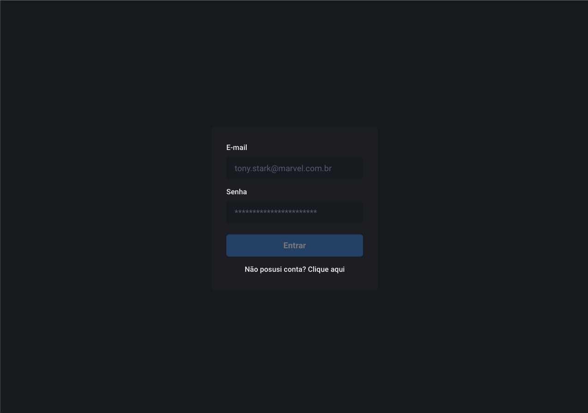
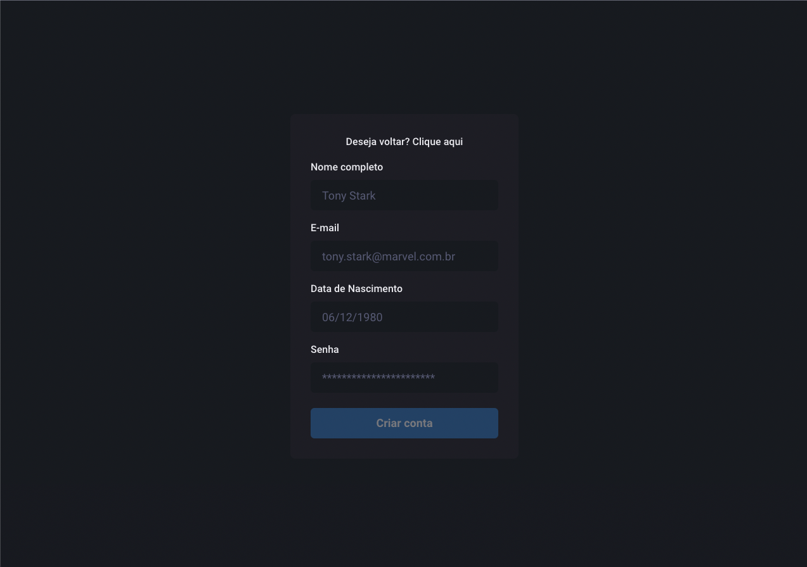

# Dash UI

#### Descrição
> Projeto desenvolvido para gerir usuários

## Screenshots
## Tela de Login


## Tela de Listagem de Usuários


## 💻 Tecnologias

- React.js
- Typescript
- Chakra UI
- React Hook Form
- Yup
- Redux Toolkit
- RTK Query

## 💻 Pré-requisitos

Antes de começar, verifique se você atendeu aos seguintes requisitos:

- Você possuir o Node instalado com a versão minima 16.13.2
- Você possuir o yarn instalando em sua máquina

## 🚀 Instalando `Dash UI Web App`

Faça o clone do repositório

```
git clone https://github.com/thereallucas98/fullstack-crud.git
```

Instale as dependências

```
yarn
```

Executar o Aplicativo

```
yarn run dev
```

### Quais são as features existentes?

- É possível cadastrar e logar no sistema;
- Para usuários:
  - É possível cadastrar um usuário;
  - É possível editar um usuário;
  - É possível deletar um usuário;
  - É possível listar usuários;
  - É possível pesquisar por um usuário;
- Para usuário logado:
  - Editar o seu nome;

### Quais são os recursos?
- Criar, editar, deletar e listar usuários cadastrados e logar com os mesmos.

### Quais são os known-issues?
- Logout em pathNames diferentes da raiz, ao ser clicado causa problemas na navegação - não retorna para a raiz e nem exibe componentes.

### O que existe mas não funciona?
- Paginação;
- Dasbhoard;